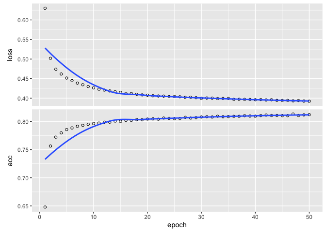

Predicting Hotel Booking Cancellations using Keras and PlaidML
================
Nik Agarwal
4/25/2020

  - [Introduction](#introduction)
  - [Background on Dataset](#background-on-dataset)
  - [Load Data](#load-data)
  - [Quick Data Insights](#quick-data-insights)
      - [Check for Missing Values](#check-for-missing-values)
          - [Conclusions](#conclusions)
      - [Number of Unique Values per
        variable](#number-of-unique-values-per-variable)
          - [Conclusions](#conclusions-1)
  - [Variable Exploration](#variable-exploration)
      - [agent](#agent)
      - [is\_canceled (the response
        variable)](#is_canceled-the-response-variable)
      - [hotel](#hotel)
  - [Feature Engineering](#feature-engineering)
  - [Dataset Preparation for Model
    Development](#dataset-preparation-for-model-development)
      - [Train/Test Split](#traintest-split)
      - [Prep Training Dataset](#prep-training-dataset)
      - [Prep Test Dataset](#prep-test-dataset)
      - [Rearrange dataset columns](#rearrange-dataset-columns)
  - [Model Development - GPU](#model-development---gpu)
      - [Define functional API](#define-functional-api)
      - [Train Model](#train-model)
      - [Predict Values for Test
        Dataset](#predict-values-for-test-dataset)
      - [Model Assessment Metrics](#model-assessment-metrics)
          - [Confusion Matrix](#confusion-matrix)
          - [Accuracy](#accuracy)
          - [AUC](#auc)
          - [Precision & Recall](#precision-recall)
          - [F1 Score](#f1-score)

# Introduction

One of my main motivations is to learn how to develop models using a
GPU. Model development using a GPU is quite a bit different than simply
building a model in-memory. For starters, you need a GPU\! What’s
interesting is that you need a *compatible* GPU that works with an
appropriate framework. For instance, if you want to use TensorFlow, you
have to have a compatible nVidia GPU. However, what if you use newer
Macs (post 2015) that are only compatible with AMD GPUs? That’s where
another framework called [PlaidML](https://github.com/plaidml/plaidml)
comes to the rescue.

PlaidML is an alternative framework to TensorFlow that enables you to
use almost any compatible GPU - such as AMD Radeon, nVidia, etc. You can
find out how to set-up PlaidML
[here](https://plaidml.github.io/plaidml/docs/install#macos). While
PlaidML may not be as mature as TensorFlow, you can easily use Keras
(the high-level wrapper) and continue on your way. Sure, I could have
used Google CoLab or AWS to learn how to build models using a GPU (and
stuck with TensorFlow). However, I prefer to do my analysis/coding on a
local machine in a non-notebook environment. But I digress.

Surprisingly, I found it challenging to find simple yet comprehensive
examples for regression and classification using keras’s functional API.
Many of the examples I found used the sequential API - which may be
easier to use, but not always the best choice. Furthermore, many of the
examples leveraged pre-processed “ready to go” datasets (see
[here](https://machinelearningmastery.com/regression-tutorial-keras-deep-learning-library-python/))
for building a neural network. I find, for myself, that it’s easier to
work with a dataset that requires some ‘cleaning’ and processing so that
it’s a bit more representative of what you see in the real world.

I have three main goals for this exercise:

  - Pick a dataset and briefly walk through a ‘usual’ data-science
    process (e.g., exploratory data analysis - EDA, feature engineering,
    train/test split, etc.)
  - Develop a simple neural network model using Keras with the
    functional API and use the PlaidML backend
  - Apply trained model to test dataset and obtain some metrics

**NOTE**: I am not interested in making the ‘perfect’ model or even a
well-performing model. I am simply creating a walk-through on how to go
from a dataset to trained neural network (i.e., deep neural network -
DNN) model using a GPU, PlaidML, and Keras.

# Background on Dataset

On February 11, 2020, the
[TidyTuesday](https://github.com/rfordatascience/tidytuesday) project
published an interesting dataset around [hotel
bookings](https://github.com/rfordatascience/tidytuesday/blob/master/data/2020/2020-02-11).
This dataset is actually from a [research
paper](https://www.sciencedirect.com/science/article/pii/S2352340918315191#f0010)
that was published in 2019.

Briefly, the dataset captures the bookings made for customers arriving
between July 1, 2015 and August 31, 2017 between two different hotel
types (resort vs. city).

While this is is a great exploratory dataset, I’m choosing to predict
whether a booking will be cancelled or not (a classic two-class
problem). Contextually speaking, this dataset may not perform well
because it may not capture the true reasons why a booking was cancelled.
However, it is a large enough dataset that I can use as a walk-through.

I am aware that this dataset is fairly ‘clean’ and ready to be analyzed.
And that’s ok\! This dataset is actually not perfect:

  - it has missing values
  - it has several categorical variables
  - new features can be created

In my view, this dataset is perfect\!

# Load Data

I will be making use of several libraries for this walkthrough:

  - {vroom}: for reading in the dataset
  - {tidyverse}: for data wrangling and plots
  - {rsample}: for creating training/test dataset
  - {recipes}: for processing both training & test datasets
  - {keras}: for neural network using GPU
  - {yardstick}: for assessing (i.e., metrics) predictions

<!-- end list -->

``` r
library(vroom)
library(tidyverse)
library(rsample)
library(recipes)
library(keras)
library(yardstick)
```

Now let’s load the dataset:

``` r
hotels <- vroom::vroom(
  file = "https://raw.githubusercontent.com/rfordatascience/tidytuesday/master/data/2020/2020-02-11/hotels.csv",
  na = c("", " ", "NA", "NULL", 'Undefined'))
```

    ## Rows: 119,390
    ## Columns: 32
    ## Delimiter: ","
    ## chr  [11]: hotel, arrival_date_month, meal, country, market_segment, distribution_channel,...
    ## dbl  [20]: is_canceled, lead_time, arrival_date_year, arrival_date_week_number, arrival_da...
    ## date [ 1]: reservation_status_date
    ## 
    ## Use `spec()` to retrieve the guessed column specification
    ## Pass a specification to the `col_types` argument to quiet this message

Have you heard of vroom? It’s basically an alternative to the
{data.table} package (in some ways), but aligned with the tidyverse
grammar. {data.table} is a great package and is FAST at almost
everything. However, I prefer vroom over {data.table}’s `fread()`
function.

One of the interesting things about `vroom()` is that you can identify
what makes up an *na* or NULL value. In this case, I populated some
example terms that I have seen used to identify NULL values. In my
experience, this is often the case where NULL values are actually
identified as “NULL” or “NA” (in other words, these are characters).

Now let’s take a quick peek at the data using the `glimpse()` function
(part of {dplyr}).

``` r
glimpse(hotels)
```

    ## Rows: 119,390
    ## Columns: 32
    ## $ hotel                          <chr> "Resort Hotel", "Resort Hotel", "Resor…
    ## $ is_canceled                    <dbl> 0, 0, 0, 0, 0, 0, 0, 0, 1, 1, 1, 0, 0,…
    ## $ lead_time                      <dbl> 342, 737, 7, 13, 14, 14, 0, 9, 85, 75,…
    ## $ arrival_date_year              <dbl> 2015, 2015, 2015, 2015, 2015, 2015, 20…
    ## $ arrival_date_month             <chr> "July", "July", "July", "July", "July"…
    ## $ arrival_date_week_number       <dbl> 27, 27, 27, 27, 27, 27, 27, 27, 27, 27…
    ## $ arrival_date_day_of_month      <dbl> 1, 1, 1, 1, 1, 1, 1, 1, 1, 1, 1, 1, 1,…
    ## $ stays_in_weekend_nights        <dbl> 0, 0, 0, 0, 0, 0, 0, 0, 0, 0, 0, 0, 0,…
    ## $ stays_in_week_nights           <dbl> 0, 0, 1, 1, 2, 2, 2, 2, 3, 3, 4, 4, 4,…
    ## $ adults                         <dbl> 2, 2, 1, 1, 2, 2, 2, 2, 2, 2, 2, 2, 2,…
    ## $ children                       <dbl> 0, 0, 0, 0, 0, 0, 0, 0, 0, 0, 0, 0, 0,…
    ## $ babies                         <dbl> 0, 0, 0, 0, 0, 0, 0, 0, 0, 0, 0, 0, 0,…
    ## $ meal                           <chr> "BB", "BB", "BB", "BB", "BB", "BB", "B…
    ## $ country                        <chr> "PRT", "PRT", "GBR", "GBR", "GBR", "GB…
    ## $ market_segment                 <chr> "Direct", "Direct", "Direct", "Corpora…
    ## $ distribution_channel           <chr> "Direct", "Direct", "Direct", "Corpora…
    ## $ is_repeated_guest              <dbl> 0, 0, 0, 0, 0, 0, 0, 0, 0, 0, 0, 0, 0,…
    ## $ previous_cancellations         <dbl> 0, 0, 0, 0, 0, 0, 0, 0, 0, 0, 0, 0, 0,…
    ## $ previous_bookings_not_canceled <dbl> 0, 0, 0, 0, 0, 0, 0, 0, 0, 0, 0, 0, 0,…
    ## $ reserved_room_type             <chr> "C", "C", "A", "A", "A", "A", "C", "C"…
    ## $ assigned_room_type             <chr> "C", "C", "C", "A", "A", "A", "C", "C"…
    ## $ booking_changes                <dbl> 3, 4, 0, 0, 0, 0, 0, 0, 0, 0, 0, 0, 0,…
    ## $ deposit_type                   <chr> "No Deposit", "No Deposit", "No Deposi…
    ## $ agent                          <dbl> NA, NA, NA, 304, 240, 240, NA, 303, 24…
    ## $ company                        <dbl> NA, NA, NA, NA, NA, NA, NA, NA, NA, NA…
    ## $ days_in_waiting_list           <dbl> 0, 0, 0, 0, 0, 0, 0, 0, 0, 0, 0, 0, 0,…
    ## $ customer_type                  <chr> "Transient", "Transient", "Transient",…
    ## $ adr                            <dbl> 0.00, 0.00, 75.00, 75.00, 98.00, 98.00…
    ## $ required_car_parking_spaces    <dbl> 0, 0, 0, 0, 0, 0, 0, 0, 0, 0, 0, 0, 0,…
    ## $ total_of_special_requests      <dbl> 0, 0, 0, 0, 1, 1, 0, 1, 1, 0, 0, 0, 3,…
    ## $ reservation_status             <chr> "Check-Out", "Check-Out", "Check-Out",…
    ## $ reservation_status_date        <date> 2015-07-01, 2015-07-01, 2015-07-02, 2…

# Quick Data Insights

## Check for Missing Values

One of the first things I like to do is check for missing values. This
is great for identifying variables (i.e., predictors) that we can
exclude early on because they have too many missing values or variables
which require imputation.

``` r
hotels %>%
  purrr::map_df(function(x) sum(is.na(x))) %>%
  tidyr::pivot_longer(
    cols = everything(),
    names_to = "variable",
    values_to = 'missing'
  ) %>%
  dplyr::arrange(desc(missing)) %>%
  dplyr::mutate(
    percent_missing = round(missing / nrow(hotels),2)
  ) %>%
  dplyr::filter(missing > 0)
```

    ## # A tibble: 7 x 3
    ##   variable             missing percent_missing
    ##   <chr>                  <int>           <dbl>
    ## 1 company               112593            0.94
    ## 2 agent                  16340            0.14
    ## 3 meal                    1169            0.01
    ## 4 country                  488            0   
    ## 5 distribution_channel       5            0   
    ## 6 children                   4            0   
    ## 7 market_segment             2            0

It seems like there are seven (7) different variables that have missing
values. Note how almost 94% of the values in the variable <company> are
missing. I can confidently say that this variable is not worth imputing
or keeping in our analysis.

### Conclusions

  - Remove the variable <company> from the entire training.
  - We can consider removing the variable <agent> since 14% of the
    observations are missing
  - We can consider simply removing the missing observations (i.e.,
    rows) for country, distribution channel, market segment, and
    children
  - We can consider imputing the missing values for meal

## Number of Unique Values per variable

Another thing we can look at is how many unique values exist for each
variable. This could help us understand which variables could be
“condensed”. Having too many categorical (i.e., ordinal &
non-ordinals) values may pose a challenge for models. Often, we can use
embeddings or one-hot encodings, but we should think about the variables
contextually. Sometimes, the variable may not make sense to keep in the
model.

``` r
hotels %>%
  purrr::map_df(function(x) length(unique(x))) %>%
  tidyr::pivot_longer(
    cols = everything(),
    values_to = 'unique_values',
    names_to = 'variable'
  ) %>%
  arrange(desc(unique_values))
```

    ## # A tibble: 32 x 2
    ##    variable                       unique_values
    ##    <chr>                                  <int>
    ##  1 adr                                     8879
    ##  2 reservation_status_date                  926
    ##  3 lead_time                                479
    ##  4 company                                  353
    ##  5 agent                                    334
    ##  6 country                                  178
    ##  7 days_in_waiting_list                     128
    ##  8 previous_bookings_not_canceled            73
    ##  9 arrival_date_week_number                  53
    ## 10 stays_in_week_nights                      35
    ## # … with 22 more rows

### Conclusions

  - From my perspective, company and agent are two variables that we
    could probably remove. If a booking is cancelled, it probably won’t
    be cancelled due to the travel agent or the company that made the
    booking. Perhaps I’m wrong, but at least in this context, I don’t
    think it’s a big deal.

  - Although there are many countries (178 unique ones), I feel that
    country could be an indicator of whether a booking may be cancelled.

# Variable Exploration

After checking for null values, I like to explore a few interesting
variables further. For the purposes of this walkthrough, I’m going to
focus on the following variables:

  - agent
  - hotel type
  - cancellation (the response variable <is_canceled>)

Generally, this would be more exhaustive, but for this walkthrough it is
not as important.

## agent

Let’s explore the variable <agent> further. First off, let’s see how
many unique values exist:

``` r
length(unique(hotels$agent))
```

    ## [1] 334

There are 334 unique values for the variable <agent>. This includes the
NULL value. Typically, we can use the {forcats} package to trim down the
number of unique values. For instance, we can identify the top 5 values
and then have a 6th value that simply means “all others”. However, if
you recall, our goal is to predict cancellation. This column seems to be
a unique identifier for the travel agent or tour operator. However, I’m
not sure if this column will be contextually important. Don’t forget, it
also is missing 14% of the values\!

For the purposes of this walkthrough, I’ll simply remove it.

Now let’s see the top 5 agents with the most cancellations:

``` r
hotels %>%
  group_by(agent) %>%
  summarize(
    total_cancelled = sum(is_canceled)
  ) %>%
  ungroup() %>%
  arrange(desc(total_cancelled)) %>%
  head(5)
```

    ## # A tibble: 5 x 2
    ##   agent total_cancelled
    ##   <dbl>           <dbl>
    ## 1     9           13264
    ## 2   240            5484
    ## 3     1            5280
    ## 4    NA            4030
    ## 5     6            1025

Seems like agent 9 has had the most cancellations. However, the issue
that I have with this variable is that the agent value has been
anonymized (we have no idea what or who agent 9 is) and there are many
missing values for this variable.

## is\_canceled (the response variable)

The response variable <is_canceled> is essentially a binary column: 1
meaning true, 0 meaning false. Let’s see if these outcomes are balanced:

``` r
hotels %>%
  dplyr::group_by(is_canceled) %>%
  dplyr::count() %>%
  dplyr::rename('observation_count' = 'n') %>%
  dplyr::mutate(
    pct = round(observation_count / nrow(hotels),2)
  )
```

    ## # A tibble: 2 x 3
    ## # Groups:   is_canceled [2]
    ##   is_canceled observation_count   pct
    ##         <dbl>             <int> <dbl>
    ## 1           0             75166  0.63
    ## 2           1             44224  0.37

The table shows that this is about a 60/40 split. It’s not really
well-balanced. This is good to know when we go to split our dataset into
training and test datasets. We’ll want to make sure that we apply
appropriate strategies to avoid an unbalanced dataset.

## hotel

This variable identifies what type of hotel the observation is for. For
instance, is it a city hotel or a resort hotel?

``` r
hotels %>%
  group_by(hotel) %>%
  count() %>%
  rename(observation_count = n) %>%
  mutate(
    pct = round(observation_count / nrow(hotels),2)
  )
```

    ## # A tibble: 2 x 3
    ## # Groups:   hotel [2]
    ##   hotel        observation_count   pct
    ##   <chr>                    <int> <dbl>
    ## 1 City Hotel               79330  0.66
    ## 2 Resort Hotel             40060  0.34

It seems that almost 70% of the booking data in our dataset are for the
city hotel. This makes sense intuitively as the city hotel will probably
have far more business-related bookings (i.e., more bookings of shorter
durations) than a resort hotel which is geared more towards vacationers.
Also, the locations of the hotels and amenities may vary.

# Feature Engineering

After having spent some time with this dataset, there are definitely a
few features that I want to create (before I dive further into some
EDA):

  - Remove the agent variable
  - discard rows that have missing values for country & children
  - create feature that looks at the day of week of arrival (M, T, W,
    etc.)
  - create feature that tells the duration of stay (planned or actual)
  - create feature that identifying total guests reservation is for
  - total cost of stay
  - create feature if meal was included in reservation or not (per the
    data dictionary, all NULL values mean no meal was included)
  - convert the variable hotel to binary (1 for city hotel, 0 for
    resort)

One of first things that I like to do before creating or deleting
columns and rows is to create another dataframe.

``` r
cln_hotel <- hotels
```

For this approach, I am going to use the {recipes} package to generate
the features.

``` r
main_recipe <- recipes::recipe(~.,data = cln_hotel) %>%
  recipes::update_role(is_canceled, new_role = 'outcome') %>%
  recipes::step_naomit(children, country) %>%
  recipes::step_mutate(
    reservation_date = lubridate::ymd(paste0(arrival_date_year,"-",arrival_date_month,"-",arrival_date_day_of_month)),
    day_of_week = lubridate::wday(reservation_date, label = T),
    stay_duration = stays_in_week_nights + stays_in_weekend_nights,
    total_guests = adults + children + babies,
    total_cost = stay_duration * adr,
    meal_included = case_when(meal %in% c('SC','Undefined') ~ 0, TRUE ~ 1),
    city_hotel = ifelse(hotel == 'City Hotel', 1, 0),
    roomtype_different = case_when(reserved_room_type != assigned_room_type ~ 1, TRUE ~ 0)
  ) %>%
  recipes::step_filter(
    total_cost > 0
  ) %>%
  recipes::step_rm(
    agent,
    company,
    arrival_date_year, 
    arrival_date_month, 
    arrival_date_week_number, 
    arrival_date_day_of_month, 
    stays_in_weekend_nights, 
    stays_in_week_nights, 
    adults, 
    children, 
    babies, 
    reservation_status, 
    reservation_status_date, 
    adr, 
    meal, 
    distribution_channel, 
    reservation_date,
    hotel,
    reserved_room_type,
    assigned_room_type
  )
```

Now let’s apply the recipe to our main dataframe called cln\_hotel. As a
bit of humor, I love Mexican food and I have named my dataframes as
such. Hadley & Jenny Bryan would not approve\!

``` r
grande_meal <- recipes::prep(main_recipe, data = cln_hotel, strings_as_factors = FALSE)
burrito <- recipes::juice(grande_meal, everything())

glimpse(burrito)
```

    ## Rows: 116,959
    ## Columns: 20
    ## $ is_canceled                    <dbl> 0, 0, 0, 0, 0, 0, 1, 1, 1, 0, 0, 0, 0,…
    ## $ lead_time                      <dbl> 7, 13, 14, 14, 0, 9, 85, 75, 23, 35, 6…
    ## $ country                        <chr> "GBR", "GBR", "GBR", "GBR", "PRT", "PR…
    ## $ market_segment                 <chr> "Direct", "Corporate", "Online TA", "O…
    ## $ is_repeated_guest              <dbl> 0, 0, 0, 0, 0, 0, 0, 0, 0, 0, 0, 0, 0,…
    ## $ previous_cancellations         <dbl> 0, 0, 0, 0, 0, 0, 0, 0, 0, 0, 0, 0, 0,…
    ## $ previous_bookings_not_canceled <dbl> 0, 0, 0, 0, 0, 0, 0, 0, 0, 0, 0, 0, 0,…
    ## $ booking_changes                <dbl> 0, 0, 0, 0, 0, 0, 0, 0, 0, 0, 0, 1, 0,…
    ## $ deposit_type                   <chr> "No Deposit", "No Deposit", "No Deposi…
    ## $ days_in_waiting_list           <dbl> 0, 0, 0, 0, 0, 0, 0, 0, 0, 0, 0, 0, 0,…
    ## $ customer_type                  <chr> "Transient", "Transient", "Transient",…
    ## $ required_car_parking_spaces    <dbl> 0, 0, 0, 0, 0, 0, 0, 0, 0, 0, 0, 0, 0,…
    ## $ total_of_special_requests      <dbl> 0, 0, 1, 1, 0, 1, 1, 0, 0, 0, 3, 1, 0,…
    ## $ day_of_week                    <ord> Wed, Wed, Wed, Wed, Wed, Wed, Wed, Wed…
    ## $ stay_duration                  <dbl> 1, 1, 2, 2, 2, 2, 3, 3, 4, 4, 4, 4, 4,…
    ## $ total_guests                   <dbl> 1, 1, 2, 2, 2, 2, 2, 2, 2, 2, 2, 3, 2,…
    ## $ total_cost                     <dbl> 75.00, 75.00, 196.00, 196.00, 214.00, …
    ## $ meal_included                  <dbl> 1, 1, 1, 1, 1, 1, 1, 1, 1, 1, 1, 1, 1,…
    ## $ city_hotel                     <dbl> 0, 0, 0, 0, 0, 0, 0, 0, 0, 0, 0, 0, 0,…
    ## $ roomtype_different             <dbl> 1, 0, 0, 0, 0, 0, 0, 0, 0, 0, 1, 0, 0,…

Note the new features and the removal of redundant columns.

# Dataset Preparation for Model Development

## Train/Test Split

Typically, I create 3 different datasets: training, validation, and
test. Essentially, the model is built on the training dataset and the
validation dataset is used to ‘prove’ out the model. I only use the test
dataset as the absolute final dataset in which to prove out my trained
model. Generally speaking, if my model fails on the test dataset, but
performs well on the training and validation datasets, I start to look
at the way the data were split. However, many issues can contribute to a
model performing well on both training and validation datasets, but not
performing well on the test dataset.

For this case study, I am only going to create a training and test
dataset as I’m not interested in building the perfect model (if one can
call it that), but rather a model using Keras.

``` r
set.seed(8837)
splits <- rsample::initial_split(burrito, prop = 0.8, strata = is_canceled)

df_train <- splits %>% rsample::training()
df_test <- splits %>% rsample::testing()
```

## Prep Training Dataset

Recall from earlier that there is a bit of a class imbalance on the
response variable, <is_canceled>. Let’s take a look at the imbalance in
the training dataset.

``` r
df_train %>%
  group_by(is_canceled) %>%
  count() %>%
  ungroup() %>%
  mutate(
    percent = round(n / sum(n),2)
  )
```

    ## # A tibble: 2 x 3
    ##   is_canceled     n percent
    ##         <dbl> <int>   <dbl>
    ## 1           0 58408    0.62
    ## 2           1 35161    0.38

One of the solutions we have here is that we can downsample the response
variable (a method recommended by one my heros, Max Kuhn) to balance the
response variable. And we can do this with more recipes\!

Since we are wanting to create a neural network, all the values must be
numerical. Here’s what our recipes are doing:

  - Converting the days of week (e.g., Monday, Tuesday, etc.) to a
    number
  - Converting the response variable to a factor
  - Downsampling the training data so that the cancelled
    vs. non-cancelled observations are balanced
  - Removing variables that overwhelmingly contain one value (see
    [step\_nzv
    documentation](https://tidymodels.github.io/recipes/reference/step_nzv.html))
    and almost no variance.

<!-- end list -->

``` r
model_recipe <- recipes::recipe(~., data = df_train) %>%
  recipes::update_role(is_canceled, new_role = 'outcome') %>%
  recipes::update_role(meal_included, city_hotel, is_repeated_guest, roomtype_different, new_role = 'pred_binary') %>%
  recipes::step_normalize(recipes::all_numeric(), -recipes::has_role('pred_binary'), -is_canceled) %>%
  recipes::step_string2factor(recipes::has_type(match = 'nominal')) %>%
  recipes::step_ordinalscore(day_of_week) %>%
  recipes::step_integer(recipes::all_nominal()) %>%
  recipes::step_bin2factor(is_canceled) %>%
  recipes::step_downsample(is_canceled) %>%
  recipes::step_factor2string(is_canceled) %>%
  recipes::step_mutate(is_canceled = case_when(is_canceled == 'yes' ~ 1, TRUE ~ 0)) %>%
  recipes::step_nzv(everything()) %>%
  recipes::prep(training = df_train, strings_as_factors = FALSE)
```

Let’s take a look at the new training data.

``` r
ds_train <- juice(model_recipe)
glimpse(ds_train)
```

    ## Rows: 70,322
    ## Columns: 16
    ## $ is_canceled               <dbl> 1, 1, 1, 1, 1, 1, 1, 1, 1, 1, 1, 1, 1, 1, 1…
    ## $ lead_time                 <dbl> -0.19044878, -0.28411535, -0.77118151, -0.5…
    ## $ country                   <dbl> 128, 128, 128, 128, 128, 128, 128, 128, 128…
    ## $ market_segment            <dbl> 7, 6, 7, 7, 7, 7, 7, 7, 7, 6, 7, 7, 7, 4, 7…
    ## $ previous_cancellations    <dbl> -0.1012815, -0.1012815, -0.1012815, -0.1012…
    ## $ booking_changes           <dbl> -0.3402986, -0.3402986, -0.3402986, -0.3402…
    ## $ deposit_type              <dbl> 1, 1, 1, 1, 1, 1, 1, 1, 1, 1, 1, 1, 1, 1, 1…
    ## $ customer_type             <dbl> 3, 3, 3, 3, 3, 3, 3, 3, 3, 3, 3, 3, 3, 3, 3…
    ## $ total_of_special_requests <dbl> 0.5385384, -0.7203114, -0.7203114, 0.538538…
    ## $ day_of_week               <dbl> 4, 4, 4, 5, 5, 5, 5, 5, 5, 6, 6, 6, 6, 6, 6…
    ## $ stay_duration             <dbl> -0.1821324, -0.1821324, 0.2124028, 0.212402…
    ## $ total_guests              <dbl> 0.03699141, 0.03699141, 0.03699141, 1.58495…
    ## $ total_cost                <dbl> -0.35433807, -0.14263245, 0.38437941, 0.213…
    ## $ meal_included             <dbl> 1, 1, 1, 1, 1, 1, 1, 1, 1, 1, 1, 1, 1, 1, 1…
    ## $ city_hotel                <dbl> 0, 0, 0, 0, 0, 0, 0, 0, 0, 0, 0, 0, 0, 0, 0…
    ## $ roomtype_different        <dbl> 0, 0, 0, 0, 0, 0, 0, 0, 0, 0, 0, 0, 0, 0, 0…

Let’s see if the response variable is now balanced.

``` r
ds_train %>%
  group_by(is_canceled) %>%
  count() %>%
  ungroup() %>%
  mutate(
    pct = n / sum(n)
  )
```

    ## # A tibble: 2 x 3
    ##   is_canceled     n   pct
    ##         <dbl> <int> <dbl>
    ## 1           0 35161   0.5
    ## 2           1 35161   0.5

## Prep Test Dataset

Now let’s apply the recipe to the test dataset.

``` r
new_dftest <- recipes::bake(model_recipe, df_test)
glimpse(new_dftest)
```

    ## Rows: 23,390
    ## Columns: 16
    ## $ booking_changes           <dbl> -0.3402986, -0.3402986, -0.3402986, -0.3402…
    ## $ city_hotel                <dbl> 0, 0, 0, 0, 0, 0, 0, 0, 0, 0, 0, 0, 0, 0, 0…
    ## $ country                   <dbl> 56, 128, 128, 72, 49, 72, 49, 118, 56, 128,…
    ## $ customer_type             <dbl> 3, 3, 3, 3, 3, 1, 3, 4, 1, 3, 3, 3, 1, 3, 3…
    ## $ day_of_week               <dbl> 4, 4, 4, 5, 5, 5, 5, 5, 5, 6, 6, 6, 6, 6, 6…
    ## $ deposit_type              <dbl> 1, 1, 1, 1, 1, 1, 1, 1, 1, 1, 1, 1, 1, 1, 1…
    ## $ is_canceled               <dbl> 0, 1, 1, 0, 0, 0, 0, 0, 0, 1, 1, 0, 1, 1, 0…
    ## $ lead_time                 <dbl> -0.92104802, -0.42461520, -0.08741556, -0.3…
    ## $ market_segment            <dbl> 4, 7, 4, 6, 7, 6, 6, 6, 6, 7, 7, 7, 6, 6, 7…
    ## $ meal_included             <dbl> 1, 1, 1, 1, 1, 1, 1, 1, 1, 1, 1, 1, 1, 1, 1…
    ## $ previous_cancellations    <dbl> -0.1012815, -0.1012815, -0.1012815, -0.1012…
    ## $ roomtype_different        <dbl> 0, 0, 0, 1, 1, 0, 0, 0, 1, 0, 0, 0, 0, 0, 1…
    ## $ stay_duration             <dbl> 0.2124028, 1.3960084, 2.5796141, 1.0014732,…
    ## $ total_cost                <dbl> 0.74472941, 1.15612898, 2.15910313, 0.08709…
    ## $ total_guests              <dbl> 0.03699141, 0.03699141, 0.03699141, 0.03699…
    ## $ total_of_special_requests <dbl> 0.5385384, 1.7973881, 1.7973881, -0.7203114…

## Rearrange dataset columns

We rearrange the columns so that it’s easier to work with. This is
probably optional, but I did this for my own sanity.

``` r
ds_train <- ds_train %>%
  select(
    country,
    customer_type,
    day_of_week,
    market_segment,
    lead_time,
    previous_cancellations,
    booking_changes,
    deposit_type,
    total_of_special_requests,
    stay_duration,
    total_guests,
    total_cost,
    meal_included,
    city_hotel,
    roomtype_different,
    is_canceled
  )

new_dftest <- new_dftest %>%
    select(
    country,
    customer_type,
    day_of_week,
    market_segment,
    lead_time,
    previous_cancellations,
    booking_changes,
    deposit_type,
    total_of_special_requests,
    stay_duration,
    total_guests,
    total_cost,
    meal_included,
    city_hotel,
    roomtype_different,
    is_canceled
  )
```

# Model Development - GPU

Now we’re going to build a neural network model using the GPU. Since I’m
using a MacBook Pro with an external GPU that is NOT an nVidia brand, I
will use PlaidML as the backend. Note that PlaidML is similar to
tensorflow, but unlike it, PlaidML is compatible with almost any video
card including the built-in one on the MacBook. However, I don’t
recommend using the integrated video card; I made that mistake and my
MacBook basically froze in terror.

``` r
# define environment for GPU usage
use_python('/usr/local/bin/python3')
keras::use_virtualenv("~/python-virtual-environments/deeplearning/")
use_backend('plaidml')
```

## Define functional API

``` r
# define embedding sizes

embed_cntry = 50
embed_custtype = 2
embed_day = 4
embed_marketsegment = 4


# define inputs

input_country <- layer_input(shape = 1, name = 'country_embedding_input')
input_custype <- layer_input(shape = 1, name = 'customertype_embedding_input')
input_day <- layer_input(shape = 1, name = 'day_embedding_input')
input_marketsegment <- layer_input(shape = 1, name = 'marketsegment_embedding_input')
input_allvars <- layer_input(shape = 11, name = 'remaining_predictors_input')

# define embeddings

## no more than 50 or number of unique values / 2

cntry_embedding <- layer_embedding(
  input_dim = 155,
  output_dim = embed_cntry,
  input_length = 1,
  name = 'embedding_country'
)

custype_embedding <- layer_embedding(
  input_dim = 4,
  output_dim = embed_custtype,
  input_length = 1,
  name = 'embedding_customertype'
)

dayofweek_embedding <- layer_embedding(
  input_dim = 7,
  output_dim = embed_day,
  input_length = 1,
  name = 'embedding_dayofweek'
)
 
marketsegment_embedding <- layer_embedding(
  input_dim = 7,
  output_dim = embed_marketsegment,
  input_length = 1,
  name = 'embedding_marketsegment'
)
 
 
emb_cntry <- input_country %>%
 cntry_embedding() %>%
 layer_flatten()

emb_custype <- input_custype %>%
  custype_embedding() %>%
  layer_flatten()

emb_dayofweek <- input_day %>%
  dayofweek_embedding() %>%
  layer_flatten()

emb_marketsegment <- input_marketsegment %>%
  marketsegment_embedding() %>%
  layer_flatten()

pred_vars <- layer_concatenate(list(emb_cntry, emb_custype, emb_dayofweek, emb_marketsegment, input_allvars))

# layer definition
h1 <- layer_dense(pred_vars, units = 60, activation = 'relu')
d1 <- layer_dropout(h1, rate = 0.2)
h2 <- layer_dense(pred_vars, units = 30, activation = 'relu')
d2 <- layer_dropout(h2, rate = 0.1)
o1 <- layer_dense(d2, units = 1, activation = 'sigmoid')

# we want class probabilities

# model definition

model <- keras_model(
  inputs = list(input_country, input_custype, input_day, input_marketsegment, input_allvars),
  outputs = o1
)

model %>% compile(
  loss = 'binary_crossentropy',
  optimizer = 'adam',
  metrics = c('accuracy')
)

summary(model)
```

    ## ________________________________________________________________________________
    ## Layer (type)              Output Shape      Param #  Connected to               
    ## ================================================================================
    ## country_embedding_input ( (None, 1)         0                                   
    ## ________________________________________________________________________________
    ## customertype_embedding_in (None, 1)         0                                   
    ## ________________________________________________________________________________
    ## day_embedding_input (Inpu (None, 1)         0                                   
    ## ________________________________________________________________________________
    ## marketsegment_embedding_i (None, 1)         0                                   
    ## ________________________________________________________________________________
    ## embedding_country (Embedd (None, 1, 50)     7750     country_embedding_input[0][
    ## ________________________________________________________________________________
    ## embedding_customertype (E (None, 1, 2)      8        customertype_embedding_inpu
    ## ________________________________________________________________________________
    ## embedding_dayofweek (Embe (None, 1, 4)      28       day_embedding_input[0][0]  
    ## ________________________________________________________________________________
    ## embedding_marketsegment ( (None, 1, 4)      28       marketsegment_embedding_inp
    ## ________________________________________________________________________________
    ## flatten_1 (Flatten)       (None, 50)        0        embedding_country[0][0]    
    ## ________________________________________________________________________________
    ## flatten_2 (Flatten)       (None, 2)         0        embedding_customertype[0][0
    ## ________________________________________________________________________________
    ## flatten_3 (Flatten)       (None, 4)         0        embedding_dayofweek[0][0]  
    ## ________________________________________________________________________________
    ## flatten_4 (Flatten)       (None, 4)         0        embedding_marketsegment[0][
    ## ________________________________________________________________________________
    ## remaining_predictors_inpu (None, 11)        0                                   
    ## ________________________________________________________________________________
    ## concatenate_1 (Concatenat (None, 71)        0        flatten_1[0][0]            
    ##                                                      flatten_2[0][0]            
    ##                                                      flatten_3[0][0]            
    ##                                                      flatten_4[0][0]            
    ##                                                      remaining_predictors_input[
    ## ________________________________________________________________________________
    ## dense_2 (Dense)           (None, 30)        2160     concatenate_1[0][0]        
    ## ________________________________________________________________________________
    ## dropout_2 (Dropout)       (None, 30)        0        dense_2[0][0]              
    ## ________________________________________________________________________________
    ## dense_3 (Dense)           (None, 1)         31       dropout_2[0][0]            
    ## ================================================================================
    ## Total params: 10,005
    ## Trainable params: 10,005
    ## Non-trainable params: 0
    ## ________________________________________________________________________________

## Train Model

``` r
history <- fit(
  object = model,
  y = ds_train %>% pull(is_canceled),
  x = list(
    as.matrix(ds_train %>% pull(country)), 
    as.matrix(ds_train %>% pull(customer_type)),
    as.matrix(ds_train %>% pull(day_of_week)),
    as.matrix(ds_train %>% pull(market_segment)),
    as.matrix(ds_train %>% select(-country, -customer_type, -day_of_week,-market_segment, -is_canceled))
    ),
  batch_size = 1000,
  epochs = 50,
  validaton_split = 0.3
)

print(history)
```

    ## Trained on 70,322 samples (batch_size=1,000, epochs=50)
    ## Final epoch (plot to see history):
    ## loss: 0.3922
    ##  acc: 0.8121

``` r
plot(history)
```

    ## `geom_smooth()` using formula 'y ~ x'

<!-- -->

## Predict Values for Test Dataset

``` r
yhat_class_pred <- predict(
  object = model, 
    x = list(
    as.matrix(new_dftest %>% pull(country)), 
    as.matrix(new_dftest %>% pull(customer_type)),
    as.matrix(new_dftest %>% pull(day_of_week)),
    as.matrix(new_dftest %>% pull(market_segment)),
    as.matrix(new_dftest %>% select(-country, -customer_type, -day_of_week,-market_segment, -is_canceled))
    )
  ) %>%
  as.vector()
```

## Model Assessment Metrics

I’m going to create a simple tibble that enables me to capture the test
values and the predicted values. This will enable assessing the metrics
using the package {yardstick} much more easily.

``` r
test_tbl <- tibble::tibble(
  truth = as.factor(new_dftest$is_canceled) %>% fct_recode(cancelled = '1', not_cancelled = '0'),
  class_prob = yhat_class_pred
) %>%
  dplyr::mutate(
    predicted_class = ifelse(class_prob >= 0.5, 1, 0),
    estimate = as.factor(predicted_class) %>% fct_recode(cancelled = '1', not_cancelled = '0')
  ) %>%
  dplyr::select(-predicted_class)
```

### Confusion Matrix

``` r
test_tbl %>%
  yardstick::conf_mat(truth, estimate)
```

    ##                Truth
    ## Prediction      not_cancelled cancelled
    ##   not_cancelled         12409      2002
    ##   cancelled              2192      6787

### Accuracy

``` r
test_tbl %>%
  yardstick::metrics(truth, estimate) %>%
  dplyr::select(.metric, .estimate)
```

    ## # A tibble: 2 x 2
    ##   .metric  .estimate
    ##   <chr>        <dbl>
    ## 1 accuracy     0.821
    ## 2 kap          0.619

### AUC

``` r
test_tbl %>%
  yardstick::roc_auc(truth, class_prob) %>%
  dplyr::select(.metric, .estimate)
```

    ## # A tibble: 1 x 2
    ##   .metric .estimate
    ##   <chr>       <dbl>
    ## 1 roc_auc     0.897

### Precision & Recall

``` r
tibble(
  precision = test_tbl %>% yardstick::precision(truth,estimate) %>% pull(.estimate),
  recall = test_tbl %>% yardstick::recall(truth, estimate) %>% pull(.estimate)
)
```

    ## # A tibble: 1 x 2
    ##   precision recall
    ##       <dbl>  <dbl>
    ## 1     0.861  0.850

### F1 Score

``` r
test_tbl %>%
  yardstick::f_meas(truth, estimate, beta = 1) %>%
  dplyr::select(.estimate)
```

    ## # A tibble: 1 x 1
    ##   .estimate
    ##       <dbl>
    ## 1     0.855
